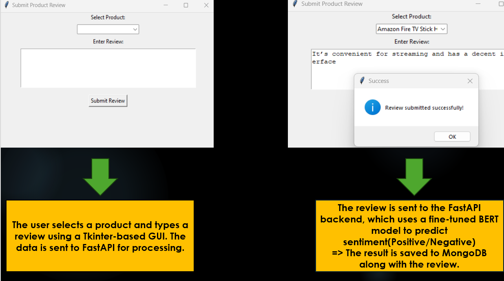
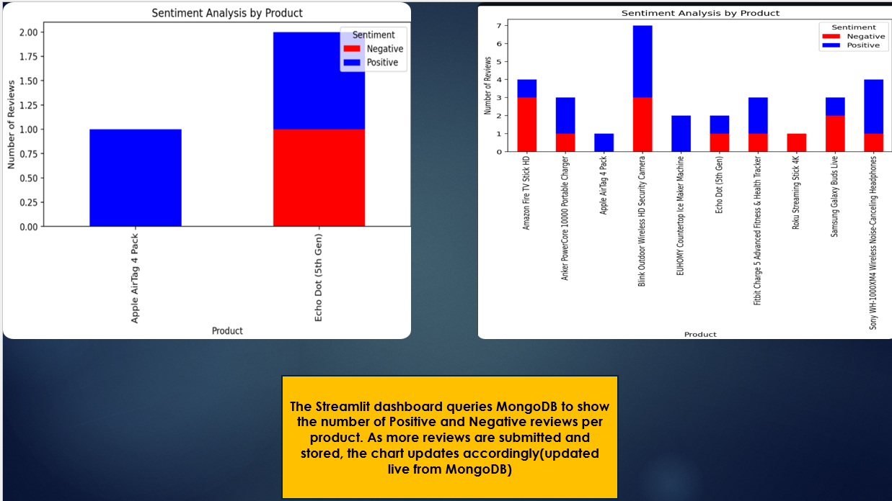

## Smart Product Review Sentiment Analysis System 

This project is a complete Product Review Sentiment Analysis System built with:

A Deep Learning  model (BERT) for sentiment classification

A FastAPI backend to serve predictions and manage product data

A Tkinter GUI to submit reviews

A Streamlit dashboard to visualize sentiment trends

MongoDB to store product and review data

##

<strong>Submit Review</strong>

  

##

<strong>Dashboard</strong>

  

**BERT Performance**

| Model Performance   | Accuracy | Samples |
|---------------------|----------|---------|
| **Fine_tune_bert**  | 95.42%   | 50000   |
| **prediction**      | 94.24%   | 5000    |

## Program Structure 

- **PRODUCT_REVIEW/**
  - **backend/**
    - `app.py` – FastAPI main app
    - `auth.py` – password-based authentication
    - `db.py` – MongoDB collections setup
  - **bert_model/** – Fine-tuned BERT model (saved from training)
    - `config.json`
    - `model.safetensors`
    - `tokenizer_config.json`
    - `vocab.txt`
  - **data/**
    - `train.csv`
    - `test.csv`
    - `download_dataset.py`
    - `convert_txt_to_csv.py`
  - **database/**
    - `setup_db.py` – MongoDB product insertions
  - **frontend/**
    - `submit_review.py` – Tkinter GUI for submitting reviews
  - `dashboard.py` – Streamlit dashboard for sentiment visualization
  - **model/**
    - `fine_tune_bert.py` – fine-tune BERT
    - `predict.py` – evaluation of model accuracy on test set
  - `README.md`

    
**How BERT is used in this project:**

The base model bert-base-uncased was used

Fine-tuned on labeled product reviews (Positive/Negative)

Adapted to classify new review text into sentiment categories

 ## BERT Model Training

**Dataset used:**  https://www.kaggle.com/datasets/bittlingmayer/amazonreviews

**Model used:** bert-base-uncased (pretrained on general English) from HuggingFace

**Fine-tuning objective:** Adapt BERT to classify product reviews as Positive or Negative

**Fine-tuned for 2 epochs**

Trained in Google Colab with GPU for better performance

**Google Colab link:** https://colab.research.google.com/drive/1iCZA1ShcbJwhNNkjp1p_I9uh0D4H6cU3?usp=sharing

**Saved using:**

trainer.save_model("./bert_model")

tokenizer.save_pretrained("./bert_model")
 

## Running the Project

**Step 1: Start Backend API (FastAPI)**

uvicorn backend.app:app --reload

**Step 2: Launch Review Submission UI**

python frontend/submit_review.py

**Step 3: Launch Sentiment Dashboard**

streamlit run frontend/dashboard.py

